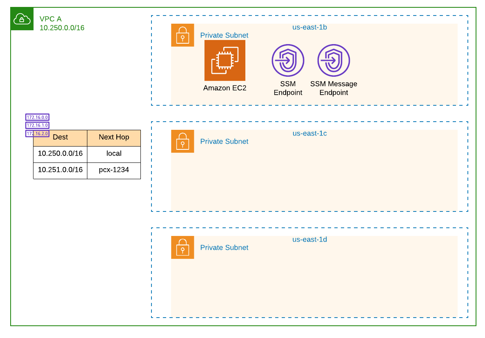
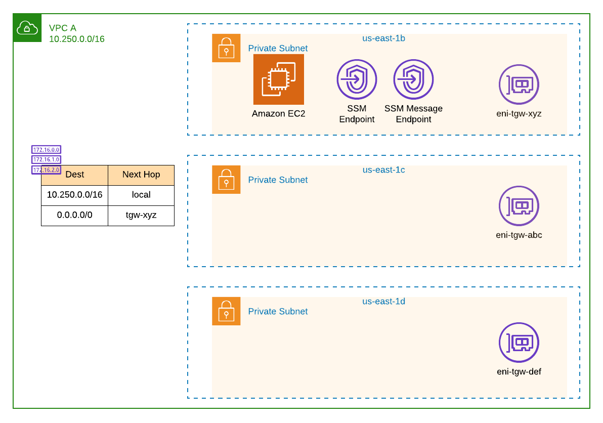

## Overview

This repository contains a number of CloudFormation templates that are intended to:

* Create a Transit Gateway with a single, non-default route table.
* Stand up an environment of 2 VPCs, VPC A and VPC B, and establish a peering connection between them.
* Create an EC2 instance in each VPC, and using [Systems Manager Session Manager](https://docs.aws.amazon.com/systems-manager/latest/userguide/session-manager.html), connect to each and stand up a ping. This should validate connectivity between the two VPCs.
* Once connectivity has been established across the peering connection, attach the VPCs to the Transit Gateway and update the route tables.
* Remove the peering connection and confirm connectivity still exists between VPC A and VPC B via Transit Gateway.

### Step 1 - Create a Transit Gateway

First we want to create a Transit Gateway with a single, non-default route table. This route table will
be used for the "spoke" VPCs when they are attached to the Transit Gateway. In this step, though,
we will simply create the Transit Gateway and route table with no attachments.

1. Clone this repository so all of the templates are stored locally.
2. Change into the `templates` directory.
3. Run the following command:

```bash
aws cloudformation create-stack --stack-name bidmc-poc-tgw \
    --template-body file://1-tgw.yaml --region us-east-1
```

Make sure to note the name of your stack. In the example above, it's: `bidmc-poc-tgw`. You will need this later!

### Step 2 - Deploy VPC A and VPC B

Now we will stand up 2 VPCs, each with a single EC2 instance in them. Once complete, we will establish a peering
connection between them.

**Important!!** To make things easy, copy the commands below verbatim. Otherwise,
you will need to update the parameters JSON files appropriately.

1. From the `templates` directory, run the following to create VPC A:

```bash
aws cloudformation create-stack --stack-name bidmc-poc-vpc-a \
    --template-body file://2-vpc.yaml \
    --parameters file://vpc-a-parameters.json \
    --region us-east-1 --capabilities CAPABILITY_IAM
```
2. Once that completes, run the following to create VPC B:

```bash
aws cloudformation create-stack --stack-name bidmc-poc-vpc-b \
    --template-body file://2-vpc.yaml \
    --parameters file://vpc-b-parameters.json \
    --region us-east-1 --capabilities CAPABILITY_IAM
```

Now we need to establish a peering connection between these two VPCs. This requires 
standing up a peering connection and updating the route tables of each VPC to use
the peering connection appropriately. 

3. Run the following to create the VPC peering connection:

```bash
aws cloudformation create-stack --stack-name bidmc-poc-peering \
    --template-body file://3-vpc-peering.yaml \
    --parameters file://vpc-peering-parameters.json \
    --region us-east-1
```

So what did we just build? At a high level:


Drilling in to VPC A we have:



### Step 3 - Check Connectivity

In the previous step we deployed 2 VPCs, each with a single EC2 instance in them.
Now we will use Systems Manager Session Manager to connect to one of the two instances
and ping the instance in the other VPC. We will do this to confirm connectivity
between the two VPCs, and once we cutover to Transit Gateway, ensure this connectivity
remains.

1. In your console, ensure you are in the region where you deployed these VPCs.
2. From the **Services** dropdown, go to **CloudFormation**.
3. Select the stack for VPC B. If you copied the commands above, this should be `bidmc-poc-vpc-b`.
4. Select the **Outputs** tab and copy the value of `EC2InstanceIP`. 
5. From the **Services** dropdown, go to **Systems Manager**.
6. Click on **Session Manager** from the column on the left.
7. Click the **Start session** button at the top right.
8. Select `bidmc-poc-vpc-a` and click **Start session**.
9. Using the IP address from step 4, run the following, being sure to replace `<IP address>`:

```bash
ping <IP address>
```
If successful, you should see output similar to:

```bash
64 bytes from 10.250.0.160: icmp_seq=1 ttl=255 time=0.143 ms
64 bytes from 10.250.0.160: icmp_seq=2 ttl=255 time=0.559 ms
64 bytes from 10.250.0.160: icmp_seq=3 ttl=255 time=0.160 ms
64 bytes from 10.250.0.160: icmp_seq=4 ttl=255 time=0.213 ms
64 bytes from 10.250.0.160: icmp_seq=5 ttl=255 time=0.157 ms
```

Leave this going in the background and move on to **Step 4**.

### Step 3a - How This Works

But wait - how does this work without a NAT instance? Or an EIP and an Internet Gateway?

In the VPC template, we set up PrivateLink endpoints for the Systems Manager Service.
Essentially, a network interface was placed into the VPC with an appropriate security group
to allow connections to it from within the VPC. A DNS entry in a private hosted zone
was also added so that the requests to the SSM endpoint would resolve to the interface
within the VPC and not the public endpoint. Check this out to [learn more about PrivateLink](https://aws.amazon.com/privatelink/).

### Step 4 - Connect the VPCs via Transit Gateway

Now that we know the VPCs can communicate over the VPC peering connection, lets
establish connectivity via the Transit Gateway which will be used to replace the
VPC peering connection. 

By the end of this step, the VPCs should look like this:


VPC A will look similar to:



1. From the **Services** dropdown, go to **CloudFormation**.
2. Click on the stack for VPC A. If you followed the steps above, this should be `bidmc-poc-vpc-a`.
3. Click the **Update** button.
4. With **Use current template** selected, click **Next**.
5. Change the value of `ConnectToSharedVpc` to **true**.
6. Change the value of `ConnectToSpokeVpc` to **true**.
7. Click **Next**.
8. Click **Next**.
9. Select the checkbox to acknowledge creation of IAM resources, and click **Update stack**.
10. Repeat steps **2-9** but for VPC B, or stack `bidmc-poc-vpc-b`.

Once complete, you should now have attached the VPCs to the Transit Gateway and
updated the **rtb-spokes** route table with each of the VPC's CIDR range. Additionally,
a new default route should have been added to each VPC that specifies the Transit
Gateway as the next hop.

### Step 5 - Remove the VPC Peering Connection

With the Transit Gateway connectivity in place, let's delete the VPC peering stack
and ensure the connectivity remains.

1. From the **Services** dropdown, go to **CloudFormation**.
2. Find the stack named `bidmc-poc-peering`. Select it and click the **Delete** button.
3. Jump back to the **Session Manager** window and ensure the ping is still running. If so, success!

We have now proven connectivity between the two VPCs exist, and we successfully 
continuted that connectivity from an existing VPC peering connection to a Transit
Gateway.